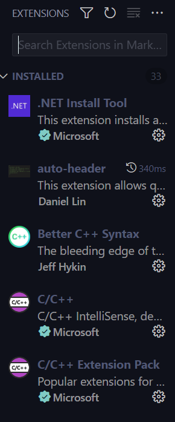

## What is VSCode

VSCode is a basic text editor with all sorts of plugins and various language support
You can get VSCode [here](https://code.visualstudio.com/download)

## What are we doing with it?
In this guide we will be installing a plugin called WSL in vscode which automatically connects to and uses WSL's terminal environment
Along with this just for ease of access we will be installing C/C++ Extension pack

1. on the left side of the screen you will see a sidebar with these symbols, click the bottom one that looks like Tetris blocks, this is the *Extension Menu*
   
   2. It will look something like this, in the search bar look up C/C++ Extension Pack, click it, click install, do the same for the WSL extension and restart your VS

3. Open the *Remote Explorer* Tab,